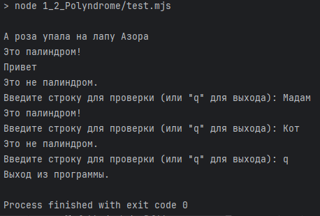
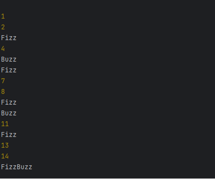
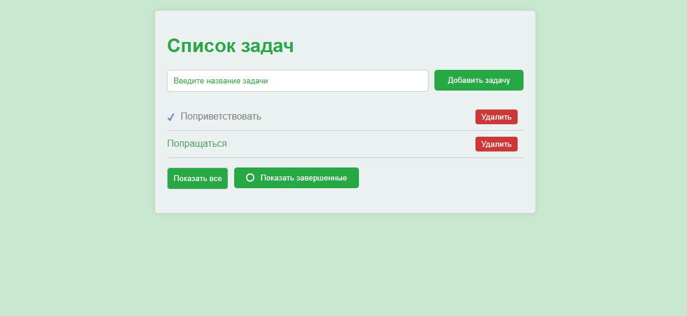
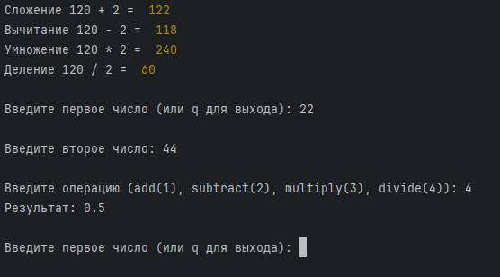
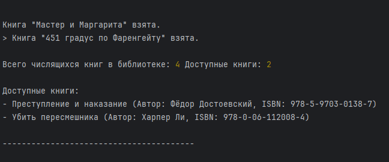
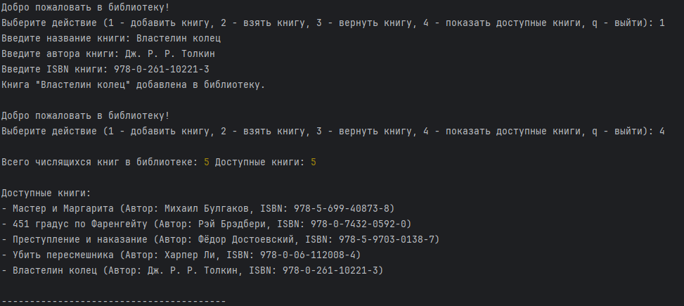
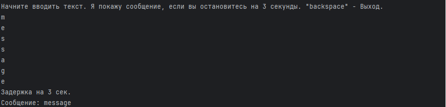
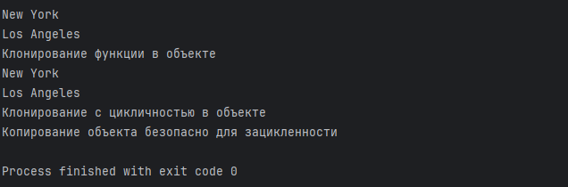

## Тестовые задания JS Assessment

Инструкции
● Выполните следующие задания, используя только чистый JavaScript.  
● Не используйте внешние библиотеки (например, jQuery).  
● Предоставьте решения с комментариями и объяснениями, где это необходимо.  
● Разрешено использовать современные функции JavaScript (ES6+).  

Для запуска потребуется установить node.js пакет  

Все команды можно посмотреть в package.json

Всё запускаяется команды npm run
Краткий список команд запуска через npm:

`npm run test-polindrome`  
`npm run test-fizzBuzz`  
`npm run test-chunkArray`  
`npm run test-dom`  
`npm run test-async-js`  
`npm run test-calculator`  
`npm run test-library`  
`npm run test-debounce`  
`npm run test-deepClone`  

#### Установка node.js с использованием nvm
Сслыка на иснтсуркцию быстрой установки через nvm  
https://timeweb.cloud/tutorials/nodejs/kak-ustanovit-node-js-na-windows  
Ссылка на github nvm  
https://github.com/coreybutler/nvm-windows

Добавлена http-server зависимость в проект для открытия index.html,  
через с запуск сервера для обхода CORS политики.

### Команда для запуска

## Задание 1: Основные алгоритмические задачи

### 1.1 Проверка на палиндром

1. Проверка на палиндром  
   Напишите функцию, которая проверяет, является ли строка палиндромом. Палиндром
   — это слово, фраза, число или другая последовательность символов, которая
   читается одинаково слева направо и справа налево (игнорируя пробелы, знаки
   препинания и регистр).  

   #### Команда запуска:
   
   `npm run test-polindrome`

   

### 1.2. FizzBuzz

Напишите функцию, которая выводит числа от 1 до 100. Но для кратных трём
выводите "Fizz" вместо числа, а для кратных пяти — "Buzz". Для чисел, кратных как
трём, так и пяти, выводите "FizzBuzz".

   #### Команда запуска:

   `npm run test-fizzBuzz`

### 1.3. Разбиение массива на части

`npm run test-chunkArray`

## Задание 2: Манипуляции с DOM

Приложение для списка дел  
   Создайте простое приложение для списка задач, используя HTML, CSS и JavaScript.  
   Приложение должно включать следующие функции:  
   ● Текстовое поле для добавления новых задач.  
   ● Кнопка для добавления задачи в список.    
   ● Возможность отметить задачу как выполненную (по клику на нее).
   ● Завершённая задача должна отличаться от незавершённой визуально.  
   ● Кнопка для удаления задачи.  
   Требуется:
1. Манипулировать DOM для динамического добавления задач в список.
2. Обработать завершение и удаление задачи с помощью событий JavaScript.  
   Бонус: Добавьте возможность фильтрации задач (например, показать только
   завершённые или незавершённые задачи).

#### Команда запуска:
`npm run test-dom`

## Задание 3: Асинхронный JavaScript

   1. Fetch API — Случайные пользователи  
      Используйте Random User API, чтобы получить 10 случайных пользователей и  
      отобразить их в виде списка. Для каждого пользователя нужно отобразить его имя,  
      email и фотографию профиля.  
      Требуется:  
      ● Использовать fetch для выполнения запроса к API.  
      ● Обрабатывать состояние загрузки (например, показывать «Загрузка...», пока
      данные получаются).  
      ● Обрабатывать ошибки в случае неудачи запроса к API (например, показывать
      сообщение «Не удалось загрузить пользователей»).  
   
   2. Карусель изображений  
      Создайте карусель изображений, где изображения автоматически сменяются каждые 3
      секунды. Также добавьте кнопки «Назад» и «Вперед» для ручной смены изображения.  
      Требуется:  
      ● Использовать JavaScript для управления сменой изображений.  
      ● Настроить таймер с помощью setInterval для автоматической смены  
      изображений.  
      ● Обработать кнопки «Назад» и «Вперед» с помощью событий.  

#### Команда запуска:

`npm run test-async-js`

## Задание 4: Объектно-ориентированный JavaScript

   1. Реализация простого калькулятора  
      Создайте класс Calculator, который симулирует работу простого калькулятора с
      методами:  
      ● add(a, b) - возвращает сумму a и b.    
      ● subtract(a, b) - возвращает разность a и b.  
      ● multiply(a, b) - возвращает произведение a и b.  
      ● divide(a, b) - возвращает результат деления a на b. Если b равно 0,  
      возвращает сообщение об ошибке.  
      Создайте экземпляр класса и продемонстрируйте его использование, вызывая методы
      с разными аргументами.

#### Команда запуска:

`npm run test-calculator`

   2. Система управления библиотекой
         Создайте класс Book с следующими свойствами:
         ● Название
         ● Автор
         ● ISBN
         ● Статус (взята или доступна)
         Далее создайте класс Library, который:
         ● Позволяет добавлять новые книги.
         ● Позволяет брать книгу по её ISBN.
         ● Позволяет возвращать взятую книгу по её ISBN.
         ● Показывает список доступных книг.
         Реализуйте методы для управления книгами и их статусами.

#### Команда запуска:

`npm run test-library`

## Задание 5: Решение проблем и оптимизация

   1. Функция debounce.  
      Напишите функцию debounce. Эта функция должна гарантировать, что данная
      функция не вызывается слишком часто. При вызове она должна ожидать
      определенное количество времени перед выполнением. Если функция вызывается
      снова в течение этого времени, таймер должен быть сброшен.

#### Команда запуска:

`npm run test-debounce`

   2. Глубокое клонирование объекта.  
      Напишите функцию, которая выполняет глубокое клонирование объекта, т.е.
      вложенные объекты также должны быть склонированы, а не переданы по ссылк

#### Команда запуска:

`npm run test-deepClone`

